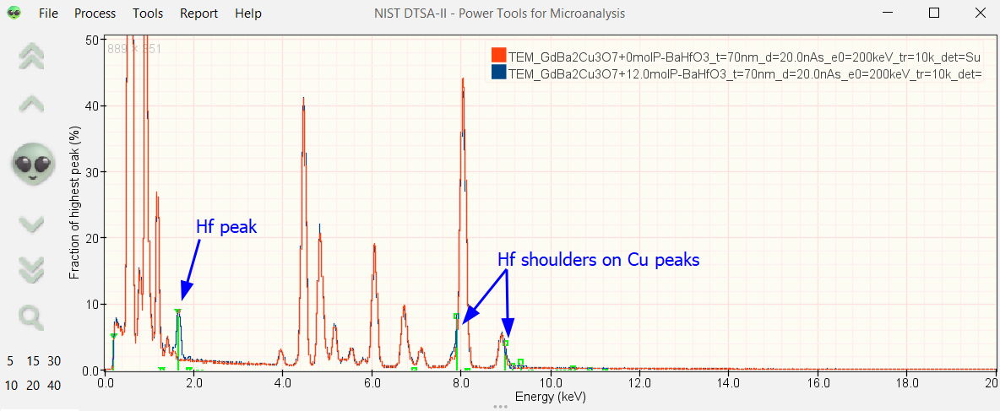
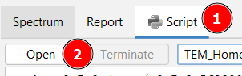

# EDS Simulation Scripts for NIST DTSA-II 

This repository contains Jython script templates for [NIST DTSA-II](https://www.cstl.nist.gov/div837/837.02/epq/dtsa2/index.html) ([introduction video](https://www.youtube.com/watch?v=K7w9WOIdVyY)) for simulating energy-dispersive x-ray spectroscopy (EDS) spectra via Monte Carlo method.

DTSA-II is maintained by Nicholas Ritchie. Please cite relevant papers if the simulations help your research (e.g., https://doi.org/10.1017/S1431927609990407).

The scripts can help in getting a better understanding of explore EDS physics (generation and detection) and aid in planning experiments:
* Check for **critical EDS peak overlaps**
* Check feasibility of **trace-element detection** (for a given experimental conditions)
* Check effect of different **primary beam energies** and **doses**
* Check effect of a **detector window** on low-energy x-ray absorption

The source code for [DTSA-II](https://github.com/usnistgov/DTSA-II) and the [EPQ Library](https://github.com/usnistgov/EPQ/tree/master/src/gov/nist/microanalysis) are available through GitHub.

## Example

Simulation of a 70 nm thick TEM sample of GdBa2Cu3O7 at 200 keV with and without added 12 mol% BaHfO3. Hf-L lines overlap with Cu-K lines and create shoulders on the strong Cu peak. A Hf-M line peak is visible at around 2 keV. No detector window was used here. 

This example is related to this [paper](https://pubs.rsc.org/en/content/articlelanding/2023/ma/d3ma00447c) (see Fig. [S5](https://www.rsc.org/suppdata/d3/ma/d3ma00447c/d3ma00447c1.pdf) for an experimental example of the Hf-L peak overlap with Cu-K).

## How It Works

NIST DTSA-II uses Monte Carlo method to simulate electron scattering and x-ray generation and transport through the sample (and detector window).
DTSA-II models electron scattering and (secondary) x-ray generation/absorption quite well, but descrepancies are to expected especially for "lesser used" low-energy x-ray transitions (e.g., M series).
Have a look at the [simulation video](https://www.youtube.com/watch?v=1703Y24tOtc).

## Usage

NIST DTSA-II comes installed with a Jython console. The scripts are loaded and executed within DTSA-II where the simulated spectra are conventiently displayed.

#### The steps to set up DTSA-II:

1. Install NIST DTSA-II and open it (see [here](https://www.cstl.nist.gov/div837/837.02/epq/dtsa2/index.html)).
2. Define an instrument with an EDS detector in DTSA-II ([PDF](https://www.cstl.nist.gov/div837/837.02/epq/dtsa2/DTSA-II_Configuration.pdf)).\
Simulations for different energy dispersion (e.g., 5/10/20 eV/channel), number of channels, detector window, etc. require the definition of multiple detectors. Call `listDetectors()` in the DTSA-II scripting window to get the detector names and IDs (`d...`)
3. **Optional:** Pre-define your sample material in DTSA-II ([Video](https://www.youtube.com/watch?v=ZWUHM2SEyMU)).\
Alternatively, this can also be done directly in the scripts (`material`class).

#### The steps to use the scripts:

1. Download/clone this repository or the desired script template (`.py` file).
2. **Recommended:** For each simulation, make a copy of the script in a separate folder. By default, the simulation results are stored in this folder.
3. Open the script in a text editor and adjust the user parameters.
4. Run the simulation by opening the script in DTSA.\

6. Different output files are generated and saved.\
`msa` files contain the spectrum data and can typically imported in any EDS software.

## Available Scripts

### TEM (homogeneous sample)
Free-standing transmission electron microscopy (TEM) sample/film of a given thickness and homogeneous composition. The `Series` scripts loop over different experimental parameters and create multiple spectra.

* `TEM_Homogeneous`\
Basic TEM sample simulation.
* `TEM_Homogeneous_Series_Thickness`\
Simulate different TEM sample thicknesses.
* `TEM_Homogeneous_Series_Dose`\
Simulate different total electron doses.

Scripts related to **doping/trace concentrations** (Please **double-check** the generated sample compositions/stoichiometries given in the DTSA console!):
* `TEM_Homogeneous_Series_ElementDopingStoichiometry`\
Simulate different doping levels of **an element** into the sample. Doping level given as **stoichiometry** ("number of atoms").
* `TEM_Homogeneous_Series_ElementDopingWeightPerc`\
Simulate different doping levels of **an element** into the sample. Doping level given as **weight%**.
* `TEM_Homogeneous_Series_ElementDopingAtomicPerc`\
Simulate different doping levels of **an element** into the sample. Doping level given as **atomic%**.
* `TEM_Homogeneous_Series_CompositionDopingWeightPerc`\
Simulate different doping levels of **another material** into the sample. Doping level given as **weight%**.
* `TEM_Homogeneous_Series_CompositionDopingMolePerc`\
Simulate different doping levels of **another material** into the sample. Doping level given as **mol%** (e.g., 1 mol% TiO2 in SrTiO3 will be (SrTiO3)0.99(TiO2)0.01).

Similar simulations as above can be performed using the `Tools -> Simulation Alien... -> Monte Carlo model of a film on a bulk, homogeneous substrate` in the GUI and specifying `None` as the substrate material.

## Additional Resources

* Many PDFs with guides are provided on the [NIST DTSA-II](https://www.cstl.nist.gov/div837/837.02/epq/dtsa2/index.html) page
* [Repository](https://github.com/jrminter/dtsa2scripts) of John Minter (mostly SEM).
* ProbeSoftware [forum](https://probesoftware.com/smf/index.php?PHPSESSID=dda3670c7e180ec1223449d6fb7472ab&board=32.0)
